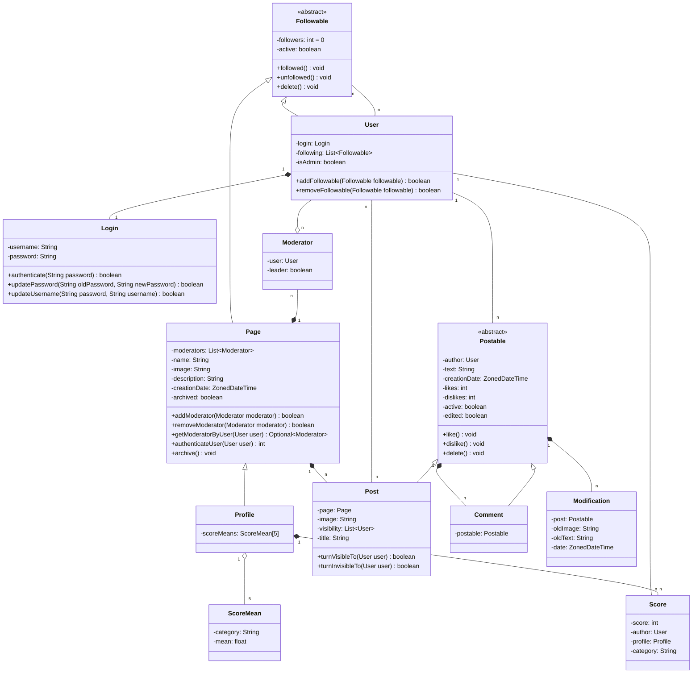

```mermaid
    classDiagram
    direction TB
    class User {
        -login: Login
        -following: List~Followable~
        -isAdmin: boolean
        +addFollowable(Followable followable) boolean
        +removeFollowable(Followable followable) boolean
    }
    class Page {
        -moderators: List~Moderator~
        -name: String
        -image: String
        -description: String
        -creationDate: ZonedDateTime
        -archived: boolean
        +addModerator(Moderator moderator) boolean
        +removeModerator(Moderator moderator) boolean
        +getModeratorByUser(User user) Optional~Moderator~
        +authenticateUser(User user) int
        +archive() void
    }
    class Login {
        -username: String
        -password: String
        +authenticate(String password) boolean
        +updatePassword(String oldPassword, String newPassword) boolean
        +updateUsername(String password, String username) boolean
    }
    class Followable {
        <<abstract>>
        -followers: int = 0
        -active: boolean
        +followed() void
        +unfollowed() void
        +delete() void
    }
    class Profile {
        -scoreMeans: ScoreMean[5] 
    }
    class Postable {
        <<abstract>>
        -author: User
        -text: String
        -creationDate: ZonedDateTime
        -likes: int
        -dislikes: int
        -active: boolean
        -edited: boolean
        +like() void
        +dislike() void
        +delete() void
    }
    class Post {
        -page: Page
        -image: String
        -visibility: List~User~
        -title: String
        +turnVisibleTo(User user) boolean
        +turnInvisibleTo(User user) boolean
    }
    class Comment {
        -postable: Postable
    }
    class Modification {
        -post: Postable
        -oldImage: String
        -oldText: String
        -date: ZonedDateTime
    }
    class Score {
        -score: int
        -author: User
        -profile: Profile
        -category: String
    }
    class Moderator {
        -user: User
        -leader: boolean
    }
    class ScoreMean {
        -category: String
        -mean: float
    }
    Followable <|-- User
    Followable <|-- Page
    Followable "n" -- "n" User
    User "1" *-- "1" Login
    User "1" -- "n" Postable
    User "1" --o "n" Moderator
    User "1" -- "n" Score
    Moderator "n" --* "1" Page
    Page "1" *-- "n" Post
    Postable "1" *-- "n" Modification
    Postable "1" *-- "n" Comment
    Profile "1" *-- "n" Score
    User "n" -- "n" Post
    Profile "1" o-- "5" ScoreMean
    Page <|-- Profile
    Postable <|-- Post
    Postable <|-- Comment
```

