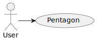

# Diagrams
## Class Diagram

<!--
@startuml classes
    skinparam classAttributeIconSize 0
    class User {
        -username: String
        -password: String
        -following: List<User>
        -followers: int = 0
        -joinDate: Instant
        -isActive: boolean
        -isAdmin: boolean
        +boolean follow(User user)
        +boolean unfollow(User user)
    }
    class Page {
        -user: User
        -name: String
        -image: String
        -description: String
        -scoreMeans: ScoreMean[5] 
        -isActive: boolean
    }
    abstract class Postable {
        -author: User
        -text: String
        -creationDate: Instant
        -likes: int
        -dislikes: int
        -isActive: boolean
        -isEdited: boolean
        +void like()
        +void dislike()
    }
    class Post {
        -page: Profile
        -image: String
        -visibility: List~User~
        -title: String
        +boolean turnVisibleTo(User user)
        +boolean turnInvisibleTo(User user)
    }
    class Comment {
        -postable: Postable
    }
    class Modification {
        -postable: Postable
        -oldImage: String
        -oldText: String
        -date: Instant
    }
    class Score {
        -score: int
        -author: User
        -profile: Profile
        -category: String
    }
    class ScoreMean {
        -category: String
        -mean: float
    }
    User "n" -- "n" User
    User "1" --o "n" Postable
    User "1" --o "n" Score
    User "n" -- "n" Post
    User "1" --o "1" Page
    Page "1" *-- "n" Post
    Page "1" *-- "n" Score
    Page "1" o-- "5" ScoreMean
    Postable "1" *-- "n" Modification
    Postable "1" *-- "n" Comment
    Postable <|-- Post
    Postable <|-- Comment
@enduml
-->

## Actors Diagram

<!--
@startuml actors
:User: -> (App)
:Admin: -> (App)
"Pentagon" as (App)
@enduml
-->

## Usecase Diagram

<!--
@startuml usecase

left to right direction

actor User
actor Admin

usecase "UC01. Login" as U1
usecase "UC02. Selecionar usuário" as U2

usecase "UC03. Gerenciar página" as U3
usecase "UC04. Renomear página" as U4
usecase "UC05. Alterar imagem\nda página" as U5
usecase "UC06. Alterar descrição\nda página" as U6

usecase "UC07. Criar postagem" as U7
usecase "UC08. Selecionar postagem" as U8
usecase "UC09. Curtir postagem" as U9

usecase "UC10. Gerenciar postagem" as U10
usecase "UC11. Editar postagem" as U11
usecase "UC12. Editar visibilidade da postagem" as U12
usecase "UC13. Remover postagem" as U13

usecase "UC14. Criar comentário" as U14
usecase "UC15. Selecionar comentário" as U15
usecase "UC16. Curtir comentário" as U16

usecase "UC17. Gerenciar comentário" as U17
usecase "UC18. Editar comentário" as U18
usecase "UC19. Remover comentário" as U19

usecase "UC20. Avaliar um usuário" as U20

usecase "UC21. Gerenciar usuário" as U21
usecase "UC22. Desativar usuário" as U22
usecase "UC23. Ativar usuário" as U23

User -[#green]-> U3
User -[#green]-> U7
User -[#green]-> U9
User -[#green]-> U10
User -[#green]-> U14
User -[#green]-> U16
User -[#green]-> U17
User -[#green]-> U20
User -[#green]-> U21

Admin -[#red]-> U3
Admin -[#red]-> U10
Admin -[#red]-> U17
Admin -[#red]-> U21

U2 ..> U1 : <<inherits>>

U3 ..> U2 : <<inherits>>

U3 <.. U4 : <<extends>>
U3 <.. U5 : <<extends>>
U3 <.. U6 : <<extends>>

U7 ..> U2 : <<inherits>>
U8 ..> U2 : <<inherits>>

U9 ..> U8 : <<inherits>>
U10 ..> U8 : <<inherits>>

U10 <.. U11 : <<extends>>
U10 <.. U12 : <<extends>>
U10 <.. U13 : <<extends>>

U14 ..> U8 : <<inherits>>
U15 ..> U8 : <<inherits>>
U16 ..> U15 : <<inherits>>
U17 ..> U15 : <<inherits>>

U17 <.. U18 : <<extends>>
U17 <.. U19 : <<extends>>

U20 ..> U2 : <<inherits>>
U21 ..> U2 : <<inherits>>

U21 <.. U22 : <<extends>>
U21 <.. U23 : <<extends>>
@enduml
-->

